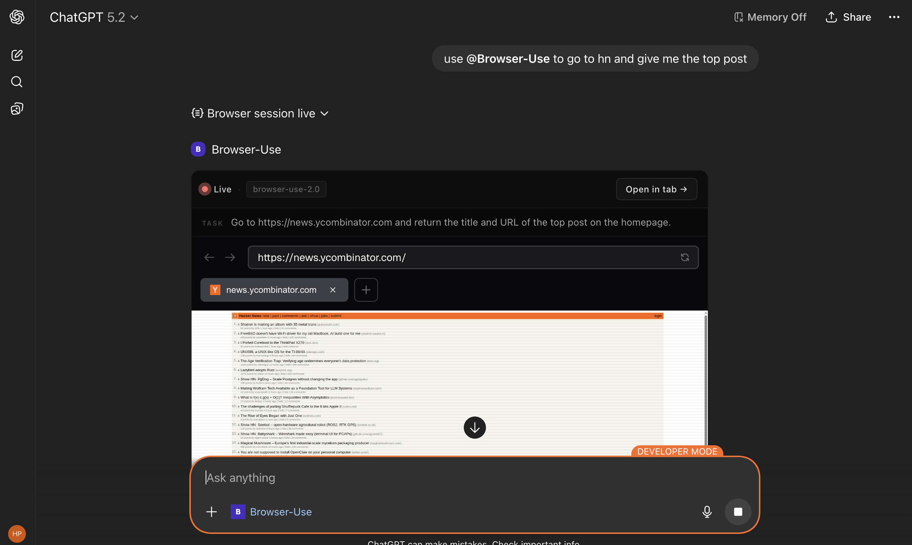

# Browser Use Live (MCP)

MCP server that runs browser automation in the cloud via [Browser Use](https://browser-use.com) and streams a **live browser session** inside ChatGPT. The model can navigate sites, click, type, and you watch it happen in real time.



*Example: asking ChatGPT to go to Hacker News and return the top post — with the live browser session embedded in the chat.*

## What it does

- **One tool:** `run_browser_task` — describe a task in plain language (e.g. “Go to news.ycombinator.com and give me the title and URL of the top post”).
- **Live view:** A widget in the chat shows the actual browser tab (live URL) while the task runs, with “Open in tab” to pop it out.
- **Models:** Supports `browser-use-2.0`, `gpt-4.1`, `gpt-4.1-mini`, `o4-mini`, `gemini-2.5-flash`, `claude-sonnet-4-6`.
- **Config:** Optional `max_steps` (1–100, default 20) to cap automation steps.

Built with [mcp-use](https://mcp-use.com) and the Browser Use Cloud API.

## Setup

1. **Clone and install**

   ```bash
   npm install
   ```

2. **API key**

   Get an API key from [Browser Use](https://browser-use.com) and set:

   ```bash
   export BROWSER_USE_API_KEY="your-key"
   ```

3. **Run the MCP server**

   ```bash
   npm run dev
   ```

   Use the URL shown (e.g. `http://localhost:3000`) in your MCP client (e.g. Cursor, ChatGPT MCP config).

## Usage in ChatGPT

- Add this server as an MCP / “Browser-Use” tool in your ChatGPT session.
- Ask in natural language, e.g. “Use @Browser-Use to go to HN and give me the top post.”
- The “Browser session live” block will show the live page; use “Open in tab →” to open it in a full tab.

## Project layout

- `index.ts` — MCP server: defines `run_browser_task`, calls Browser Use API, wires the live-view widget.
- `resources/browser-live-view.tsx` — React UI resource: live status, task text, iframe to the live URL, “Open in tab” link.

## Deploy (mcp-use)

```bash
npm run build
npm run deploy
```

## License

MIT
